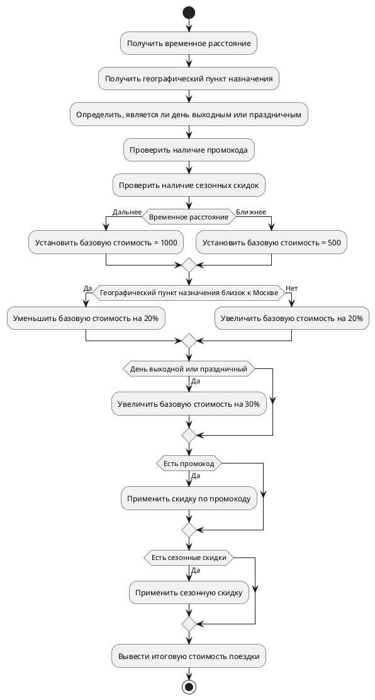

<h1  style="color: pink;">Блок-схема алгоритма расчета стоимости поездки</h1>

Объяснение блок-схемы:

1. Начало алгоритма.
2. Получение данных о временном расстоянии, географическом пункте назначения, дне недели (выходной/праздничный), наличии промокода и сезонных скидок.
3. Установка базовой стоимости поездки в зависимости от временного расстояния.
4. Корректировка базовой стоимости в зависимости от географического пункта назначения (ближе/дальше от Москвы).
5. Увеличение базовой стоимости на 30%, если день выходной или праздничный.
6. Применение скидки по промокоду (если есть).
7. Применение сезонной скидки (если есть).
8. Вывод итоговой стоимости поездки.
9. Конец алгоритма.

