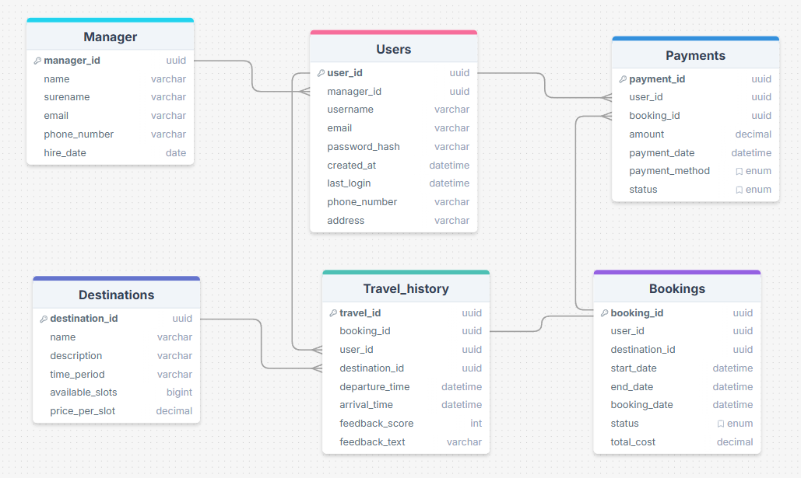

<h1  style="color: pink;">Схема и описание базы данных приложения "Машина времени"</h1>

Данный документ описывает вариант базы данных для приложения "Машина времени".

В качестве БД выбран реляционный тип, т.к. этот тип соответствует принципам ACID.

Логический уровень БД создан в drawsql и находится по ссылке: https://drawsql.app/teams/no-comand/diagrams/time-machine

### Сущность "Users" (Пользователи)
Сущность Users хранит информацию о пользователях

| Поле          | Тип                | Описание                                      |
|---------------|--------------------|-----------------------------------------------|
| user_id      | VARCHAR(36), PK, AUTO_INCREMENT | Уникальный идентификатор пользователя         |
| manager_id       | VARCHAR(20), FK            | Идентификатор менеджера, закрепленного за пользователем |
| username      | VARCHAR(50), UNIQUE | Имя пользователя                              |
| email         | VARCHAR(100), UNIQUE| Электронная почта пользователя               |
| password_hash  | VARCHAR(255)       | Хэш пароля для аутентификации                |
| created_at    | DATETIME           | Дата и время регистрации пользователя         |
| last_login     | DATETIME           | Дата и время последнего входа пользователя   |
| phone_number   | VARCHAR(20)        | Номер телефона пользователя                   |
| address        | VARCHAR(255)               | Адрес пользователя                            |

---

### Сущность "Bookings" (Бронирования)
Сущность Bookings хранит информацию о бронированиях

| Поле          | Тип                | Описание                                      |
|---------------|--------------------|-----------------------------------------------|
| booking_id    | VARCHAR(36), PK, AUTO_INCREMENT | Уникальный идентификатор бронирования        |
| user_id       | VARCHAR(36), FK            | Идентификатор пользователя, сделавшего бронирование |
| destination_id | VARCHAR(36), FK           | Идентификатор направления путешествия         |
| start_date    | DATETIME           | Дата и время начала путешествия               |
| end_date      | DATETIME           | Дата и время окончания путешествия            |
| booking_date   | DATETIME           | Дата и время создания бронирования            |
| status        | ENUM('pending', 'confirmed', 'cancelled') | Статус бронирования                     |
| total_cost    | DECIMAL(10,2)      | Общая стоимость бронирования                  |

---

### Сущность "Destinations" (Направления)
Сущность Destinations хранит информацию о направлениях и стоимости.

| Поле            | Тип                | Описание                                      |
|-----------------|--------------------|-----------------------------------------------|
| destination_id   | VARCHAR(36), PK, AUTO_INCREMENT | Уникальный идентификатор направления        |
| name            | VARCHAR(100)       | Название направления                          |
| description     | VARCHAR(255)               | Описание направления                          |
| time_period     | VARCHAR(50)        | Исторический период, в который можно отправиться |
| available_slots  | INT                | Количество доступных временных слотов        |
| price_per_slot   | DECIMAL(10,2)      | Стоимость одного временного слота            |

---

### Сущность "Manager" (Сотрудники)
Сущность Employees хранит информацию о сотрудниках.

| Поле           | Тип                | Описание                                      |
|----------------|--------------------|-----------------------------------------------|
| manager_id    | VARCHAR(36), PK, AUTO_INCREMENT | Уникальный идентификатор сотрудника        |
| name           | VARCHAR(100)       | Полное имя сотрудника                        |
| email          | VARCHAR(100), UNIQUE| Электронная почта сотрудника                 |
| phone_number    | VARCHAR(20)        | Номер телефона сотрудника                     |
| hire_date      | DATETIME           | Дата приема на работу                        |

---

### Сущность "Travel_history" (История путешествий)
Сущность Travel_history хранит информацию об истории путешествий во времени.

| Поле            | Тип                | Описание                                      |
|-----------------|--------------------|-----------------------------------------------|
| travel_id       | VARCHAR(36), PK, AUTO_INCREMENT | Уникальный идентификатор записи в истории путешествий |
| booking_id      | VARCHAR(36), FK            | Идентификатор бронирования                   |
| user_id         | VARCHAR(36), FK            | Идентификатор пользователя, совершившего путешествие |
| destination_id   | VARCHAR(36), FK           | Идентификатор направления путешествия         |
| departure_time  | DATETIME           | Дата и время начала путешествия               |
| arrival_time    | DATETIME           | Дата и время окончания путешествия            |
| feedback_score  | INT                | Оценка пользователем путешествия (от 1 до 5) |
| feedback_text   | VARCHAR(255)               | Текстовый отзыв пользователя                  |

---

### Сущность "Payments" (Платежи)
Сущность Payments хранит информацию о платежах.

| Поле            | Тип                | Описание                                      |
|-----------------|--------------------|-----------------------------------------------|
| payment_id      | VARCHAR(36), PK, AUTO_INCREMENT | Уникальный идентификатор платежа            |
| booking_id      | VARCHAR(36), FK            | Идентификатор бронирования, к которому относится платеж |
| user_id         | VARCHAR(36), FK            | Идентификатор пользователя, совершившего платеж |
| amount          | DECIMAL(10,2)      | Сумма платежа                                |
| payment_date    | DATETIME           | Дата и время проведения платежа               |
| payment_method   | ENUM('credit_card','debit_card','cash_payment') | Способ оплаты |
| status          | ENUM('pending', 'completed', 'failed') | Статус платежа                           |
